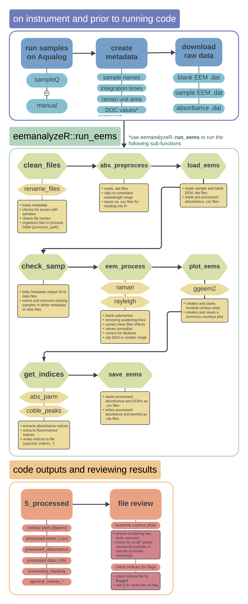

<!-- README.md is generated from README.Rmd. Please edit that file -->

# eemanalyzeR

<!-- badges: start -->
<!-- badges: end -->

This package provides tools for processing and analyzing raw
excitation-emission matrices (EEMs) data generated using an Aqualog.
This package was designed to build upon the
[eemR](https://cran.r-project.org/web/packages/eemR/index.html) and
[staRdom](https://cran.r-project.org/package=staRdom) packages to create
a more streamlined and automated workflow that ensures consistent
analysis and simplify the coding required to process the data.

It offers functions to clean and preprocess raw optics (absorbance and
fluorescence) data, perform quality assurance on the data, calculate
various indices for characterization (e.g., fluorescence index,
humification index), and generate a range of visualizations including
contour plots and 3D surface plots.

The package is designed for environmental and analytical chemists
working with fluorescence spectroscopy data, particularly in the study
of complex environmental samples like water or soil. It streamlines data
processing and visualization, helping users extract meaningful
information from EEM datasets.

## Installation

You can install the development version of eemanalyzeR from
[GitHub](https://github.com/) with:

``` r
# install.packages("pak")
pak::pak("katiewampler/eemanalyzeR")
```

## Workflow

Below is a flow chart illustrating the pre-processing steps and data
required, the functions and sub-functions contained in the main
processing function, and the post-processing outputs and review process.



## Example

This is a basic example which shows you how to solve a common problem:

``` r
library(eemanalyzeR)
## basic example code
```
